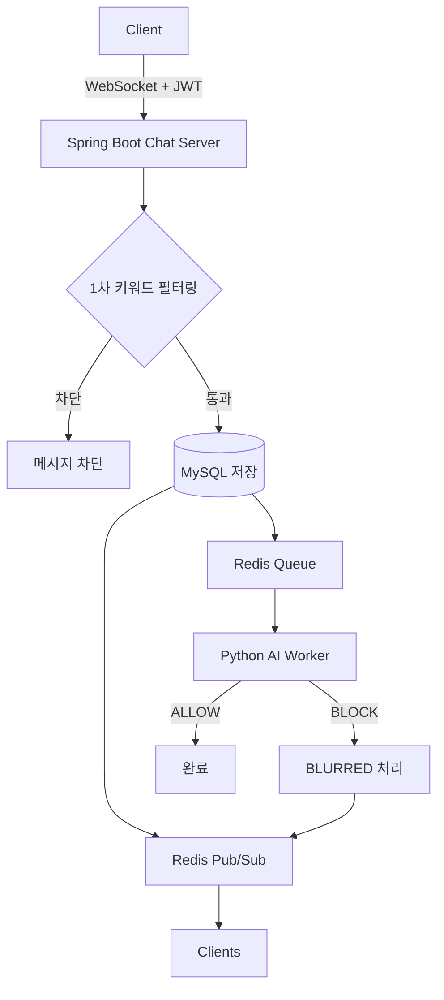

# ChatGuard

**ChatGuard**는 대용량 실시간 라이브 스트리밍 채팅 환경에서 욕설 및 혐오 표현을 **1차 키워드 필터링(동기)**과 **2차 AI 모더레이션(비동기)**의 2단계 구조로 검열하여, 실시간으로 차단하거나 블러 처리하는 안정적인 채팅 플랫폼입니다.
React 프론트엔드, Spring Boot 채팅 서버, Python AI 모더레이션 워커가 Redis(Pub/Sub 및 Queue)와 MySQL을 중심으로 연동됩니다.

---

# 프로젝트 소개

## 기획 의도

인터넷 라이브 스트리밍 플랫폼에서 채팅은 사용자 간 소통의 핵심 수단이지만, 악성 댓글과 욕설, 혐오 표현이 실시간으로 노출되어 시청자와 스트리머의 경험을 크게 저해할 수 있습니다.
ChatGuard는 이러한 유해 메시지를 실시간으로 빠르게 필터링하여 더욱 안전하고 건전한 채팅 환경을 제공하기 위해 기획되었습니다.

## 프로젝트 특징

- ✅ 2단계 실시간 채팅 모더레이션
- ✅ Redis Pub/Sub 기반 다중 파드 메시지 전파
- ✅ Python AI Worker와 Spring Boot 서버 분리
- ✅ KEDA 기반 AI Worker 자동 확장
- ✅ BRPOPLPUSH 기반 Reliable Queue 구현
- ✅ GitOps(ArgoCD) 기반 자동 배포

## 핵심 처리 흐름



### 처리 과정

1. 클라이언트는 `room_id`와 JWT를 포함하여 웹소켓에 연결합니다.
2. 서버는 JWT를 검증하고 채팅방 존재 여부를 확인한 뒤 세션을 생성합니다.
3. 메시지를 수신하면 서버 메모리에 캐싱된 금칙어 목록으로 1차 키워드 필터링을 수행합니다.
4. 필터링을 통과한 메시지는 MySQL에 저장한 뒤 Redis Pub/Sub으로 즉시 전파하고, 동시에 AI 모더레이션 큐에 적재합니다.
5. Python AI 워커는 큐에서 메시지를 가져와 `kor_unsmile` 모델로 혐오 표현을 판정합니다.
6. `BLOCK`으로 판정되면 메시지를 `BLURRED` 상태로 변경하고 `moderation.hide` 이벤트를 발행하여 이미 노출된 메시지를 모든 클라이언트에서 실시간으로 블러 처리합니다.
7. AI 워커는 처리 완료 시 ACK를 수행하며, 실패한 메시지는 재시도 후 데드레터 큐(DLQ)로 이동시켜 유실을 방지합니다.

---

# 주요 기능

- **실시간 채팅 및 다중 파드 메시지 전파**
  - 웹소켓을 통해 여러 채팅 서버 파드 간 Redis Pub/Sub 채널(`room:{id}`)을 이용하여 메시지를 안정적으로 송수신합니다.

- **2단계 실시간 검열**
  - 1차 키워드 필터링으로 욕설을 즉시 차단하고 발신자에게 오류를 반환합니다.
  - 2차 AI 모더레이션을 통해 혐오 표현을 판정하고, 필요한 경우 사후 블러 처리합니다.

- **관리자 기능**
  - 전역 금칙어 CRUD(메모리 캐시 및 Redis 동기화)
  - 채팅방 실시간 얼리기(Freeze)
  - 모더레이션 로그 조회
  - 대시보드 통계 제공

- **실시간 참여자 관리**
  - Redis Hash를 이용하여 채팅방별 참여자 수와 참여자 목록을 관리하고, 현재 상태와 변경 이벤트를 실시간으로 전송합니다.

---

# 기술 스택

| 영역 | 기술 |
|------|------|
| **Backend** | Spring Boot, Spring Security(JWT), Spring WebSocket, Spring Data JPA |
| **Frontend** | React, Vite, React Router, Tailwind CSS |
| **AI Moderation** | Python, PyTorch, Hugging Face Transformers (`kor_unsmile`) |
| **Database** | MySQL (Amazon RDS) |
| **Cache & Queue** | Redis (Amazon ElastiCache), Pub/Sub, List Queue |
| **Storage** | Amazon S3 |
| **Container** | Docker, Amazon ECR |
| **Orchestration** | Amazon EKS, KEDA, Karpenter |
| **CI/CD** | GitHub Actions(OIDC), ArgoCD(GitOps) |
| **IaC** | Terraform |
| **Monitoring** | Prometheus, Grafana, Alertmanager |
---

# 디렉터리 구조

```text
team1-chatguard-app/
├── backend/                # Spring Boot 기반 채팅 서버
├── frontend/               # React 기반 웹 프론트엔드
├── moderation-worker/      # Python 기반 AI 모더레이션 워커
└── .github/workflows/      # CI/CD 자동화 파이프라인
```

---

# 로컬 실행 방법

## 사전 준비
- JDK 17
- Node.js 20
- Python 3.11 (`torch==2.5.1` 의존)
- Docker
- Docker Compose
- AWS CLI 및 로컬 AWS 인증(`aws configure`)

---

## 실행 순서

1. MySQL 및 Redis 실행
2. Backend 실행
3. Frontend 실행
4. AI Moderation Worker 실행

---

## MySQL 및 Redis 실행
```bash
cd backend
docker compose up -d
```

---

## Backend

```bash
cd backend
cp .env.example .env
# .env 파일에서 'DB_PASSWORD', 'JWT_SECRET', `AWS_PROFILE`(로컬 AWS CLI 프로필명)을 설정합니다.

#### Windows (PowerShell / CMD)
.\mvnw.cmd spring-boot:run -Dspring-boot.run.profiles=local

#### macOS / Linux
./mvnw spring-boot:run -Dspring-boot.run.profiles=local
```
- **Health Check:** `http://localhost:8080/actuator/health`

### 필수 환경 변수

- `DB_URL`
- `DB_USER`
- `DB_PASSWORD`
- `REDIS_HOST`
- `REDIS_PORT`
- `JWT_SECRET`
- `AWS_PROFILE`

---

## Frontend

```bash
cd frontend
cp .env.example .env.local
# 생성된 .env.local 파일을 열어 VITE_USE_MOCK=true를 VITE_USE_MOCK=false로 수정합니다.

npm install
npm run dev
```

---

## AI Moderation Worker
```bash
cd moderation-worker

#### Windows (PowerShell)
.\run-unsmile.ps1

#### macOS / Linux
./run-unsmile.sh
```
- **Metrics:** `http://localhost:8000/metrics`

### 필수 환경 변수

- `DB_URL`
- `DB_USER`
- `DB_PASSWORD`
- `REDIS_HOST`
- `REDIS_PORT`
- `MOD_QUEUE_KEY`
- `UNSMILE_MODEL_ID`

  > `run-unsmile` 스크립트가 `.env` 파일을 읽어 필요한 환경 변수를 자동으로 설정합니다.

### 실행 포트

| 서비스 | 포트 |
|---------|------|
| Backend | `8080` |
| Frontend | `3000` |
| AI Worker | `8000` |

---

# CI/CD 개요

| 워크플로우 | 트리거 | 역할 |
|---|---|---|
| [ci.yml] | `pull_request` | Backend(Maven Build & Test), Frontend(Lint, Test, Build), AI Moderation Worker(Pytest 및 의존성 검사)를 수행하고 Slack으로 결과를 알립니다. |
| [deploy.yml] | `push` (`main`) | OIDC 기반 AWS 인증 후 ARM64 Docker 이미지를 빌드하여 ECR에 업로드하고, `team1-chatguard-config` 저장소의 `overlays/dev` 이미지 태그를 갱신한 뒤 Slack으로 배포 결과를 알립니다. |

---

# 관련 레포지토리

| 레포지토리 | 설명 |
|---|---|
| [team1-chatguard-app] | React 프론트엔드, Spring Boot 백엔드, Python AI 모더레이션 워커 및 CI/CD 파이프라인을 포함하는 메인 저장소 |
| team1-chatguard-config | Kubernetes Kustomize 매니페스트, ArgoCD Application, KEDA ScaledObject 등 GitOps 배포 구성을 관리하는 저장소 |
| team1-chatguard-infra | Terraform을 이용하여 VPC, Subnet, EKS, RDS, ElastiCache, ECR, IAM 등을 프로비저닝하는 인프라 저장소 |
